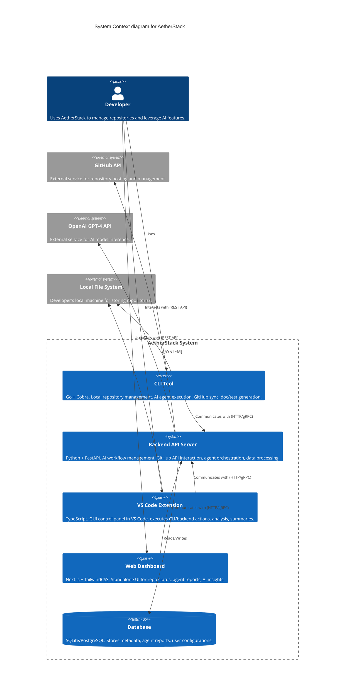
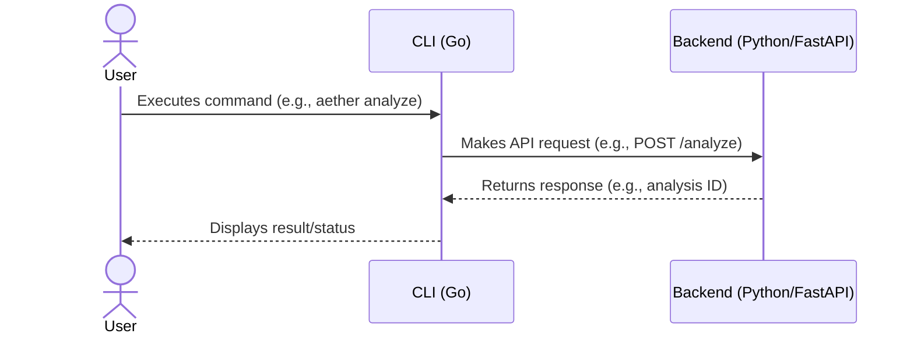

# AetherStack System Architecture

This document provides a detailed overview of the AetherStack system architecture, including its modular design, communication flows, AI agent roles, data pipelines, and interactions with the GitHub API.

## Table of Contents

- [1. Introduction](#1-introduction)
- [2. Guiding Principles](#2-guiding-principles)
- [3. System Components Overview](#3-system-components-overview)
  - [3.1. CLI Tool (Go + Cobra)](#31-cli-tool-go--cobra)
  - [3.2. Backend API Server (Python + FastAPI)](#32-backend-api-server-python--fastapi)
  - [3.3. VS Code Extension (TypeScript)](#33-vs-code-extension-typescript)
  - [3.4. Web Dashboard (Next.js + TailwindCSS)](#34-web-dashboard-nextjs--tailwindcss)
- [4. Modular Design](#4-modular-design)
  - [4.1. CLI Module](#41-cli-module)
  - [4.2. Backend Module](#42-backend-module)
  - [4.3. VS Code Extension Module](#43-vs-code-extension-module)
  - [4.4. Dashboard Module](#44-dashboard-module)
- [5. Communication Flow Diagrams](#5-communication-flow-diagrams)
  - [5.1. User to CLI to Backend](#51-user-to-cli-to-backend)
  - [5.2. User to VS Code Extension to Backend](#52-user-to-vs-code-extension-to-backend)
  - [5.3. User to Web Dashboard to Backend](#53-user-to-web-dashboard-to-backend)
  - [5.4. Backend to AI Agents](#54-backend-to-ai-agents)
  - [5.5. Backend to GitHub API](#55-backend-to-github-api)
- [6. AI Agent Roles and Data Pipelines](#6-ai-agent-roles-and-data-pipelines)
  - [6.1. Agent Orchestrator](#61-agent-orchestrator)
  - [6.2. Document Generation Agent (DocGen)](#62-document-generation-agent-docgen)
  - [6.3. Code Synchronization Agent (SyncAgent)](#63-code-synchronization-agent-syncagent)
  - [6.4. Test Generation Agent (TestGen)](#64-test-generation-agent-testgen)
  - [6.5. Repository Analysis Agent (AnalyzeAgent)](#65-repository-analysis-agent-analyzeagent)
  - [6.6. Data Flow for AI Agents](#66-data-flow-for-ai-agents)
- [7. GitHub API Interactions](#7-github-api-interactions)
  - [7.1. Authentication](#71-authentication)
  - [7.2. Repository Operations](#72-repository-operations)
  - [7.3. Webhooks (Future)](#73-webhooks-future)
- [8. Data Management](#8-data-management)
  - [8.1. Database (SQLite/PostgreSQL)](#81-database-sqlitepostgresql)
  - [8.2. Local File System](#82-local-file-system)
- [9. Scalability and Extensibility](#9-scalability-and-extensibility)
- [10. Security Considerations](#10-security-considerations)

---

## 1. Introduction

*(TODO: Briefly introduce the purpose of this document and the overall architectural goals of AetherStack.)*

## 2. Guiding Principles

*(TODO: List key architectural principles, e.g., modularity, scalability, extensibility, security, ease of use, AI integration.)*

## 3. System Components Overview

*(TODO: Provide a high-level description of each main component, referencing the diagram in README.md.)*

### 3.1. CLI Tool (Go + Cobra)
*(TODO: Detail the CLI tool's responsibilities and key architectural aspects.)*

### 3.2. Backend API Server (Python + FastAPI)
*(TODO: Detail the Backend API server's responsibilities, including API design philosophy, async nature, ORM choice, and database interaction.)*

### 3.3. VS Code Extension (TypeScript)
*(TODO: Detail the VS Code Extension's architecture, how it interacts with VS Code APIs, and its communication with the CLI/Backend.)*

### 3.4. Web Dashboard (Next.js + TailwindCSS)
*(TODO: Detail the Web Dashboard's architecture, its frontend stack, and how it fetches and displays data from the Backend.)*

## 4. Modular Design

*(TODO: Elaborate on the benefits of the chosen modular design and how it facilitates independent development and deployment.)*

### 4.1. CLI Module
*(TODO: Specifics of CLI module structure.)*

### 4.2. Backend Module
*(TODO: Specifics of Backend module structure, e.g., API routers, service layers, data access layers.)*

### 4.3. VS Code Extension Module
*(TODO: Specifics of VS Code Extension module structure.)*

### 4.4. Dashboard Module
*(TODO: Specifics of Dashboard module structure, e.g., Next.js app directory structure, components, pages.)*

## 5. Communication Flow Diagrams

*(TODO: Provide detailed Mermaid sequence diagrams or flowcharts for key interactions.)*

### 5.1. User to CLI to Backend

### 5.2. User to VS Code Extension to Backend
*(TODO: Mermaid diagram for VS Code Extension flow.)*

### 5.3. User to Web Dashboard to Backend
*(TODO: Mermaid diagram for Web Dashboard flow.)*

### 5.4. Backend to AI Agents
*(TODO: Mermaid diagram showing how the backend orchestrates AI agents.)*

### 5.5. Backend to GitHub API
*(TODO: Mermaid diagram for GitHub API interactions.)*

## 6. AI Agent Roles and Data Pipelines

*(TODO: Describe the overall strategy for AI agents, including the use of OpenAI GPT-4, LangChain, Hugging Face, and plans for local/modular agents.)*

### 6.1. Agent Orchestrator
*(TODO: Role of the orchestrator in managing agent lifecycles, inputs, and outputs.)*

### 6.2. Document Generation Agent (DocGen)
*(TODO: Purpose, inputs (code, context), outputs (Markdown docs), triggers.)*

### 6.3. Code Synchronization Agent (SyncAgent)
*(TODO: Purpose, inputs (local changes, remote state), outputs (sync plan, execution), triggers.)*

### 6.4. Test Generation Agent (TestGen)
*(TODO: Purpose, inputs (code, requirements), outputs (test cases, stubs), triggers.)*

### 6.5. Repository Analysis Agent (AnalyzeAgent)
*(TODO: Purpose, inputs (repository code, history), outputs (reports, insights, suggestions), triggers.)*

### 6.6. Data Flow for AI Agents
*(TODO: Describe how data is prepared, passed to agents, and how results are processed and stored.)*

## 7. GitHub API Interactions

*(TODO: Detail how the backend interacts with the GitHub API.)*

### 7.1. Authentication
*(TODO: OAuth, PATs, etc.)*

### 7.2. Repository Operations
*(TODO: Cloning, fetching, pushing, issue tracking, PR management, etc.)*

### 7.3. Webhooks (Future)
*(TODO: Plans for using webhooks for real-time updates.)*

## 8. Data Management

### 8.1. Database (SQLite/PostgreSQL)
*(TODO: Schema overview, data models (using SQLModel/SQLAlchemy), reasons for initial SQLite and planned PostgreSQL support.)*

### 8.2. Local File System
*(TODO: How components interact with local repositories and files.)*

## 9. Scalability and Extensibility

*(TODO: Discuss how the architecture supports scaling (e.g., stateless backend services, async processing) and future extensions (new agents, new platform integrations).)*

## 10. Security Considerations

*(TODO: Outline key security aspects, e.g., API authentication, data encryption, secure handling of credentials, input validation.)*

---
*This document is a living blueprint and will be updated as AetherStack evolves.*
